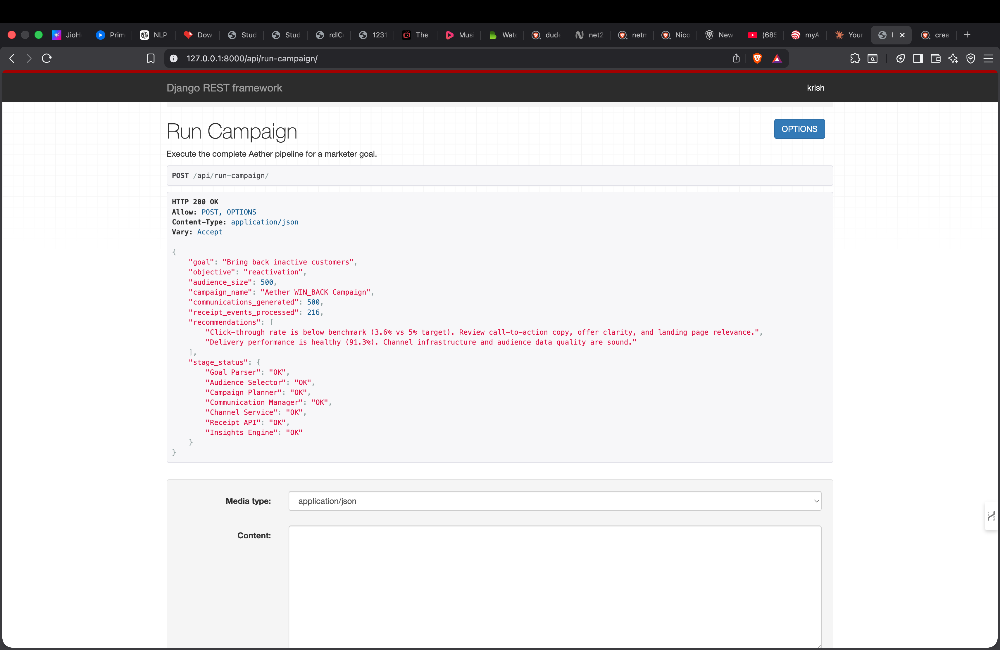
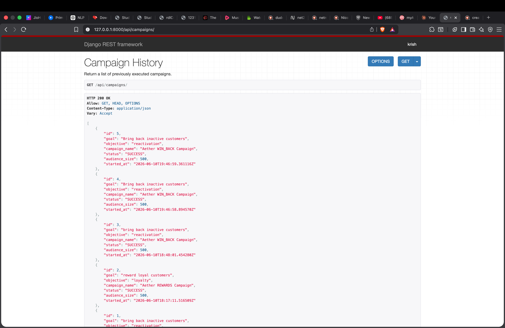
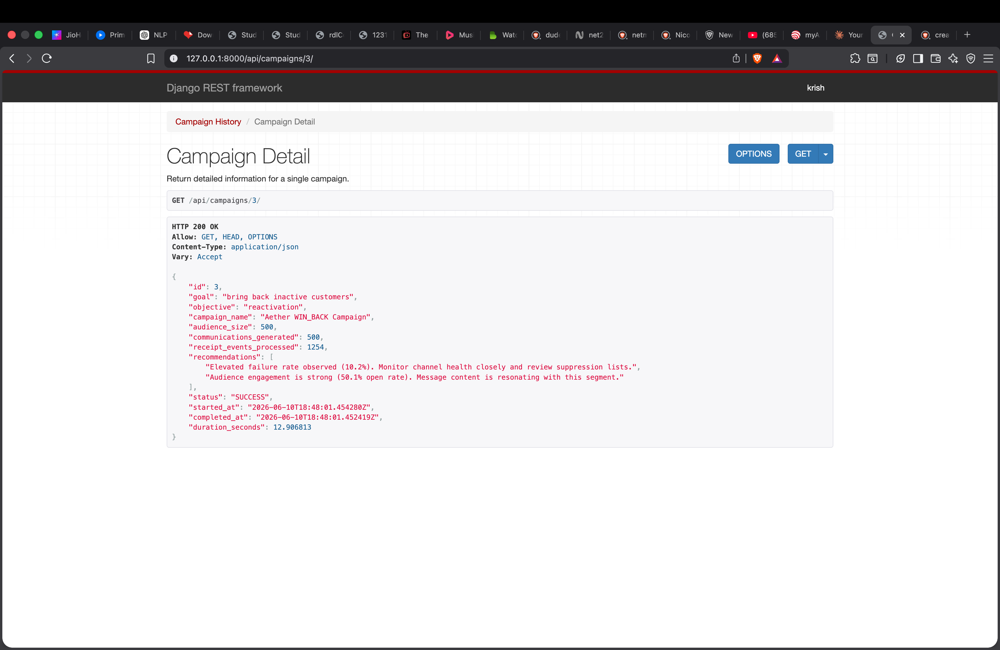

# Aether — Goal-Driven Marketing Intelligence Platform

<p align="center">
  
  
  
  
</p>

<p align="center">
  <strong>A deterministic, explainable marketing execution pipeline — built for the Xeno Forward Deployed Engineering internship challenge.</strong>
</p>

---

> **Aether is not a CRM dashboard or a recommendation widget.**
>
> A marketer states a business goal in plain English. Aether autonomously parses the intent, selects the audience, plans the campaign, generates personalized communications, simulates dispatch across channels, processes receipts, derives insights, persists the execution, and exposes everything through a clean REST API — with no human intervention at any intermediate step.

---

## Table of Contents

- [What Makes Aether Different](#what-makes-aether-different)
- [Problem Statement](#problem-statement)
- [Why Aether Exists](#why-aether-exists)
- [Architecture Overview](#architecture-overview)
- [End-to-End Execution Flow](#end-to-end-execution-flow)
- [Module Reference](#module-reference)
- [Intelligence Capabilities](#intelligence-capabilities)
- [Explainability Philosophy](#explainability-philosophy)
- [Deployment Philosophy](#deployment-philosophy)
- [Repository Structure](#repository-structure)
- [Local Setup](#local-setup)
- [Example Execution Walkthrough](#example-execution-walkthrough)
- [Supported Marketer Goals](#supported-marketer-goals)
- [Screenshots](#screenshots)
- [Testing Strategy](#testing-strategy)
- [Project Decisions and Trade-offs](#project-decisions-and-trade-offs)
- [Future Roadmap](#future-roadmap)
- [Why This Project Is Relevant for Xeno's FDA Role](#why-this-project-is-relevant-for-xenoss-fda-role)
- [Interview Talking Points](#interview-talking-points)

---

## What Makes Aether Different

Most CRM and marketing tools require marketers to operate disconnected systems: one for segmentation, another for campaign planning, a third for delivery, and yet another for analytics. The workflow is fragmented, manual, and slow.

Aether collapses the entire workflow into a single intent statement:

```
"Bring back inactive customers"
"Reward loyal customers"
"Increase average order value"
"Recommend complementary products"
```

From that input alone, Aether executes every downstream step — deterministically, with a recorded reason for every decision made.

**This is orchestration, not just prediction.** Intelligence is applied at every pipeline stage, not isolated to a single ML component.

| Principle | Choice |
|---|---|
| Predictability | Deterministic over stochastic |
| Trustworthiness | Explainability over complexity |
| Scope | End-to-end ownership over disconnected notebooks |
| Cost | Free-tier deployable — zero paid APIs required |
| Engineering | Production mindset at evaluation scale |

---

## Problem Statement

Modern marketing teams face two compounding problems:

1. **Fragmented tooling.** Segmentation, messaging, delivery, and analytics live in separate systems. Each handoff introduces delay and human error.
2. **Opaque automation.** When automation does exist, it rarely explains its decisions. Marketers can't trust what they can't interpret.

The result: campaigns are slow to launch, impossible to audit, and disconnected from measurable business outcomes.

---

## Why Aether Exists

Aether was built to answer a single question: *What if a marketer could state a goal and the system handled everything else?*

The answer required building not just a model, but a complete execution pipeline — one that understands intent, reasons about customers, constructs campaigns, delivers communications, collects receipts, and derives actionable insights, all while producing a human-readable explanation at every step.

The architecture deliberately prioritizes:

- **Determinism** — repeated inputs produce identical outputs, enabling reliable testing and demonstration.
- **Explainability** — every audience selection, health score, affinity recommendation, and campaign assignment includes a natural-language reason that a non-technical marketer can read and trust.
- **End-to-end ownership** — the system owns the complete workflow, not just one slice of it.
- **Free-tier deployability** — no paid APIs, no cloud infrastructure dependencies. The full system runs locally on Python 3.11+.

---

## Architecture Overview

Aether is a sequential, single-responsibility pipeline. Each module owns exactly one concern and passes a typed output to the next stage. Business logic never lives inside Django views.

```
╔══════════════════════════════════════════════════════════════════╗
║                MARKETER GOAL  (plain English string)             ║
╚══════════════════════╦═══════════════════════════════════════════╝
                       │
                ┌──────▼──────┐
                │ Goal Parser │  Normalize → Synonym match → Structured objective
                └──────┬──────┘  Fallback: MANUAL_REVIEW (never raises)
                       │
           ┌───────────▼───────────┐
           │   Audience Selector   │  Filter + prioritize via intelligence signals
           └───────────┬───────────┘  Output: cohort + selection reason
                       │
          ┌────────────▼────────────┐
          │    Campaign Planner     │  Name, channel strategy, offer, messaging tone
          └────────────┬────────────┘
                       │
      ┌────────────────▼────────────────┐
      │     Communication Manager       │  One personalized record per customer
      └────────────────┬────────────────┘  Deterministic IDs, unique per run
                       │
           ┌───────────▼───────────┐
           │    Channel Service    │  Simulated dispatch: EMAIL / SMS / PUSH / WHATSAPP
           └───────────┬───────────┘  Callback-driven delivery event generation
                       │
              ┌────────▼────────┐
              │   Receipt API   │  Append-only immutable event ledger
              └────────┬────────┘
                       │
          ┌────────────▼────────────┐
          │    Insights Engine      │  delivery_rate, open_rate, click_rate,
          └────────────┬────────────┘  failure_rate + explainable recommendations
                       │
    ┌──────────────────▼──────────────────┐
    │       Execution Persistence          │  Django ORM — append-only audit record
    └──────────────────┬──────────────────┘
                       │
          ┌────────────▼────────────┐
          │        REST API         │  POST run-campaign / GET campaigns / GET detail
          └─────────────────────────┘
```

### Intelligence Layer (feeds the pipeline)

```
orders.csv + products.csv
        │
        ├──→ Customer Health Engine     → customer_health.csv
        ├──→ Product Affinity Engine    → product_affinity.csv / .json
        ├──→ Story Intelligence Engine  → customer_stories.csv
        └──→ Campaign Personalizer      → personalized_campaigns.csv
                       │
                       └──→ customer_intelligence.csv
                                   │
                            Audience Selector
```

---

## End-to-End Execution Flow

```
Input:  "Reduce churn among inactive premium customers"

Step 1  Goal Parser
        → goal_type:          REACTIVATION
        → success_metric:     retention_rate
        → target_segment:     Premium Wellness Advocates
        → parser_reason:      Matched phrase 'reduce churn'. Matched audience phrase 'premium customers'.

Step 2  Audience Selector
        → Filters:            churn_risk == HIGH within target segment
        → Sort:               campaign_priority HIGH → MEDIUM → LOW
        → audience_size:      500 customers
        → selection_reason:   "Selected customers with HIGH churn_risk for reactivation.
                               Audience restricted to segment 'Premium Wellness Advocates'."

Step 3  Campaign Planner
        → campaign_name:      Aether REACTIVATION Campaign
        → channel_strategy:   EMAIL primary, SMS secondary
        → offer:              WIN-BACK: 20% off next order

Step 4  Communication Manager
        → 500 personalized communication records generated
        → IDs: deterministic within run, unique across runs

Step 5  Channel Service
        → Simulates dispatch across EMAIL, SMS, PUSH, WHATSAPP
        → Callback-driven delivery event generation

Step 6  Receipt API
        → 1,252 receipt events appended to immutable ledger

Step 7  Insights Engine
        → delivery_rate:      90.0%
        → open_rate:          47.8%
        → click_rate:         computed from receipts
        → failure_rate:       computed from receipts
        → recommendations:    ["Delivery performance is healthy (90.0%). Channel
                                infrastructure and audience data quality are sound.",
                               "Audience engagement is strong (47.8% open rate).
                                Message content is resonating with this segment."]

Output: Campaign persisted → retrievable via GET /api/campaigns/{id}/
```

---

## Module Reference

### Goal Parser

Converts a plain-English business goal into a structured campaign intent object.

**Approach:** Rule-based NLP with synonym expansion. Text is normalized (lowercased, whitespace-collapsed, hyphen-removed) before matching against a curated phrase dictionary. Unrecognized goals return a `MANUAL_REVIEW` result rather than raising an exception — the pipeline never hard-fails on ambiguous input.

**Supported goal types:** `REACTIVATION`, `RETENTION`, `UPSELL`, `CROSS_SELL`, `LOYALTY`

**Output contract:**
```python
{
    "goal_type": "REACTIVATION",
    "campaign_objective": "reactivation",
    "success_metric": "retention_rate",
    "target_segment": "Premium Wellness Advocates",
    "parser_reason": "Matched goal phrase 'reduce churn'. Matched audience phrase 'premium customers'."
}
```

**Design decision:** Embedding-based semantic matching was evaluated and deferred. Rule-based matching is deterministic, fully explainable, testable, and extensible — and the architecture is designed so the matching component can be swapped for an embedding classifier in a future version without touching any downstream module.

---

### Audience Selector

Filters and prioritizes customers from the intelligence dataset based on the parsed goal type.

**Goal-to-filter mapping:**

| Goal Type | Filter Logic |
|---|---|
| `REACTIVATION` | `churn_risk == HIGH` |
| `RETENTION` | `churn_risk == MEDIUM` AND `campaign_priority != LOW` |
| `UPSELL` | `clv_tier == HIGH` |
| `CROSS_SELL` | `clv_tier IN [MEDIUM, HIGH]` |
| `LOYALTY` | `churn_risk == LOW` AND `clv_tier == HIGH` |

Customers are sorted `HIGH → MEDIUM → LOW` by `campaign_priority` before truncation to `max_customers`. Optional segment pre-filtering is applied when the Goal Parser resolves a named persona. Every selection produces a `selection_reason` string explaining the filters applied.

**Non-responsibility:** The Audience Selector does not interpret goals. It only applies business rules to a pre-parsed objective.

---

### Campaign Planner

Constructs a structured campaign manifest from the goal type and selected audience. Produces the campaign name, channel strategy, offer type, and messaging tone. Does not generate individual communications.

---

### Communication Manager

Generates one personalized communication record per selected customer. Communication identifiers are deterministic within a pipeline run and unique across runs, enabling repeated demonstrations without duplicate-ID collisions.

**Non-responsibility:** The Communication Manager does not deliver messages. Delivery is the exclusive concern of the Channel Service.

---

### Channel Service

Simulates message dispatch across `EMAIL`, `SMS`, `PUSH`, and `WHATSAPP`. Uses a callback-driven architecture to generate delivery events. Internally calls the Receipt API via `receive_callback` — the orchestrator (`aether.py`) has no direct dependency on the Receipt API.

---

### Receipt API

An append-only immutable event ledger. Receipt records are written once and never mutated. This separation ensures that analytics (the Insights Engine) can never affect execution history — a pattern used in production event-sourced systems.

---

### Insights Engine

Derives `delivery_rate`, `open_rate`, `click_rate`, and `failure_rate` from the receipt ledger. Produces natural-language next-best-action recommendations based on computed metric thresholds. The Insights Engine is strictly read-only.

---

### Execution Persistence (Django ORM)

Every pipeline run is written once to a `CampaignExecution` model and never updated — an append-only audit log pattern.

| Field | Description |
|---|---|
| `goal` | Raw marketer goal string |
| `objective` | Resolved structured objective |
| `campaign_name` | Human-readable campaign name |
| `audience_size` | Customers targeted |
| `communications_generated` | Communication records created |
| `receipts_processed` | Receipt events appended |
| `delivery_rate` | Delivery success percentage |
| `open_rate` | Open/read percentage of delivered |
| `click_rate` | Click percentage of delivered |
| `failure_rate` | Failure percentage of dispatched |
| `recommendations` | JSON list of Insights Engine recommendations |
| `status` | `COMPLETED` / `FAILED` / `MANUAL_REVIEW` |
| `started_at` / `completed_at` | Pipeline timestamps |
| `duration_seconds` | Wall-clock execution time |

---

## Intelligence Capabilities

### Customer Intelligence

The foundation of every audience decision. One record per customer, derived from purchasing behavior and demographic signals. Fields include:

- `segment` — named customer persona (e.g. Growing Family Shoppers, Wellness Advocates)
- `churn_risk` — `HIGH / MEDIUM / LOW`
- `clv_tier` — Customer Lifetime Value tier: `HIGH / MEDIUM / LOW`
- `recommended_offer` — personalized offer type
- `recommended_channel` — preferred communication channel
- `campaign_priority` — `HIGH / MEDIUM / LOW`
- `recommended_campaign_type` — suggested campaign strategy

Every field includes a corresponding `_reason` column with a natural-language explanation.

---

### Customer Health Scoring

Scores each customer on a 0–100 scale using three behavioral signals: recency of last order, total order frequency, and CLV tier. Health status is derived from the score:

| Score Range | Status | Interpretation |
|---|---|---|
| 80–100 | `CHAMPION` | Strong purchasing behavior, consistent engagement |
| 60–79 | `LOYAL` | Healthy relationship with minor disengagement signals |
| 40–59 | `AT_RISK` | Declining activity — retention campaign recommended |
| 0–39 | `CRITICAL` | Prolonged inactivity — immediate intervention required |

Lifecycle stage is derived independently from health status using recency and order volume: `NEW`, `ACTIVE`, `LOYAL`, `CHAMPION`, `HIBERNATING`, `LOST`.

Health status feeds campaign personalization directly: `AT_RISK` customers receive `URGENT:` prefixed offers; `CRITICAL` customers receive `WIN-BACK:` prefixed offers.

**Design decision:** Survival models and XGBoost churn classifiers were considered. Heuristic scoring was chosen for its explainability and zero-infrastructure-dependency advantages. Every score is reconstructable from three observable input values.

---

### Product Affinity Engine

Identifies products that are frequently purchased together using historical co-purchase analysis across customer baskets. For each product, the top-N most frequently co-purchased products are recorded with human-readable names (not just IDs), co-purchase count, and source/recommendation metadata.

Output is available as both CSV (for downstream pipeline stages) and JSON (for API consumption). Recommendations are product-to-product, not customer-to-product — this is an intentional architectural separation.

**Design decision:** Collaborative filtering and matrix factorization were evaluated. Affinity analysis was chosen because it produces directly explainable recommendations (co-purchase count is interpretable by any marketer) with minimal computational overhead.

---

### Lifecycle Intelligence

Extends health scoring with a six-stage lifecycle classification: `NEW`, `ACTIVE`, `LOYAL`, `CHAMPION`, `HIBERNATING`, `LOST`. Each stage carries a natural-language reason describing what the stage means for re-engagement strategy.

---

### Story Customer Intelligence

Identifies meaningful life-stage narratives from purchasing behavior patterns. Rather than generic segments, story intelligence infers what may be happening in a customer's life.

**Implemented stories:**

| Story | Detection Signal | Recommended Campaign |
|---|---|---|
| `NEW_PARENT` | Baby product purchase followed by home safety product purchase | Home Safety Essentials |
| `WELLNESS_SEEKER` | 2+ purchases from wellness keyword set (vitamins, ashwagandha, collagen, omega, etc.) | Wellness Habit Bundle |
| `ECO_CONSCIOUS_HOME` | 2+ purchases from eco keyword set (beeswax, compost, reusable, etc.) | Healthy Home Collection |
| `GENERAL` | No dominant pattern detected | Personalized Recommendations |

Story assignment produces a `story_reason` that explains which behavioral signals triggered the classification.

---

### Personalized Campaign Generation

Combines health status, lifecycle stage, and story segment to produce one campaign assignment per customer. Each assignment includes a campaign name, a personalized offer (modified by health urgency), a preferred channel (sourced from customer intelligence), and a pre-authored message.

This layer ensures that two customers with the same story segment but different health statuses receive meaningfully different campaign treatments.

---

## Explainability Philosophy

Every major output in Aether includes a `_reason` or equivalent field. This is not cosmetic — it is a design constraint enforced across all intelligence generators and pipeline modules.

Reasons exist for:
- Goal parsing (`parser_reason`)
- Audience selection (`selection_reason`)
- Health scores (`health_reason`)
- Lifecycle stages (`lifecycle_reason`)
- Story assignments (`story_reason`)
- Insight recommendations (natural-language strings)

**Why this matters:** A marketing intelligence system that cannot explain its decisions cannot be trusted, debugged, or improved. Explainability is the mechanism by which AI output becomes usable by non-technical stakeholders.

All Aether explanations are generated deterministically from observable input values — not from post-hoc interpretation of opaque model weights.

---

## Deployment Philosophy

Aether was designed from the start with free-tier deployability as a hard constraint.

- No paid AI APIs are required for any core functionality.
- Intelligence is generated using rule-based systems and classical statistical analysis.
- The persistence layer uses Django's built-in SQLite support (no external database required for development).
- The pipeline runs independently of Django and can be executed from the CLI.
- All synthetic datasets are generated using `Faker` and reproducible random seeds.

Target deployment stack (post-evaluation):

| Layer | Technology |
|---|---|
| Frontend | Next.js on Vercel Free Tier |
| Backend | Django on Railway or Render Free Tier |
| Database | SQLite (dev) / PostgreSQL (prod) |
| Task queue | Celery + Redis (planned) |

---

## Repository Structure

```
aether-backend/
│
├── aether.py                          # Pipeline orchestrator — sole wiring point
│
├── campaign_brain/
│   ├── goal_parser.py                 # Stage 1: intent parsing
│   ├── audience_selector.py           # Stage 2: customer filtering and prioritization
│   └── campaign_planner.py            # Stage 3: campaign manifest construction
│
├── crm/
│   └── communication_manager.py       # Stage 4: per-customer communication generation
│
├── channel_service/
│   └── channel_service.py             # Stage 5: simulated dispatch + receipt callback
│
├── receipt_api/
│   └── receipt_api.py                 # Stage 6: append-only event ledger
│
├── insight_engine/
│   └── insight_engine.py              # Stage 7: metrics derivation + recommendations
│
├── intelligence/
│   ├── generate_customer_health.py    # Health scoring and lifecycle classification
│   ├── generate_customer_stories.py   # Life-stage narrative detection
│   ├── generate_product_affinity.py   # Co-purchase affinity analysis
│   ├── campaign_personalizer.py       # Per-customer campaign assignment
│   └── generate_customer_intelligence.py
│
├── data_generation/
│   ├── data/                          # All generated CSV and JSON datasets
│   └── generators/                    # Synthetic data generators (Faker + seed 42)
│
├── backend/
│   ├── api/
│   │   ├── views.py                   # Thin views — delegate to services.py
│   │   ├── services.py                # Calls aether.py; no business logic in views
│   │   ├── models.py                  # CampaignExecution model
│   │   ├── serializers.py
│   │   ├── urls.py
│   │   └── tests/                     # 11 automated tests
│   └── manage.py
│
├── docs/
│   ├── ProjectDecision.md             # Full architectural decision log
│   └── screenshots/
│
└── requirements.txt
```

---

## Local Setup

**Requirements:** Python 3.11+

### 1. Clone the repository

```bash
git clone https://github.com/KrishGarg546/Aether-backend.git
cd Aether-backend
```

### 2. Create and activate a virtual environment

```bash
python -m venv venv

# macOS / Linux
source venv/bin/activate

# Windows
venv\Scripts\activate
```

### 3. Install dependencies

```bash
pip install -r requirements.txt
```

### 4. Generate synthetic datasets

```bash
python data_generation/generate_all.py
```

### 5. Generate intelligence outputs

```bash
python intelligence/generate_customer_health.py
python intelligence/generate_customer_stories.py
python intelligence/generate_product_affinity.py
python intelligence/generate_customer_intelligence.py
python intelligence/campaign_personalizer.py
```

### 6. Apply database migrations

```bash
cd backend
python manage.py migrate
```

### 7. Start the development server

```bash
python manage.py runserver
```

API available at `http://127.0.0.1:8000/api/`

### 8. Run the test suite

```bash
python manage.py test api.tests
```

### 9. Run the standalone CLI (optional)

```bash
cd ..
python aether.py
```

Press Enter to run the default deterministic demo goal: `"Reduce churn among inactive premium customers"`, or type any supported goal.

---

## Example Execution Walkthrough

### Via CLI

```
$ python aether.py

     ___        _   _               _
    / _ \ _   _| |_| |__   ___   __| |___
   | | | | | | | __| '_ \ / _ \ / _` / __|
   | |_| | |_| | |_| | | | (_) | (_| \__ \
    \__\_\\__,_|\__|_| |_|\___/ \__,_|___/

AETHER: End-to-End Goal-Driven Marketing Execution Pipeline

Enter a marketing goal (press Enter to use the demo goal).
Goal [Reduce churn among inactive premium customers]: Bring back inactive customers

Pipeline Progress Checklist:
────────────────────────────────────────
  [✓ OK      ] Goal Parser
  [✓ OK      ] Audience Selector
  [✓ OK      ] Campaign Planner
  [✓ OK      ] Communication Manager
  [✓ OK      ] Channel Service
  [✓ OK      ] Receipt API
  [✓ OK      ] Insights Engine

════════════════════════════════════════════════════════════
  AETHER – Pipeline Execution Summary
════════════════════════════════════════════════════════════

────────────────────────────────────────────────────────────
  Goal                                Bring back inactive customers
  Parsed Objective                    reactivation
────────────────────────────────────────────────────────────
  Audience Size                       500 customers
  Campaign                            Aether REACTIVATION Campaign
  Communications Generated            500
  Receipt Events Processed            1,252
  Recommendations Generated           2
────────────────────────────────────────────────────────────

  Recommendations:
  1. Delivery performance is healthy (90.0%). Channel
     infrastructure and audience data quality are sound.
  2. Audience engagement is strong (47.8% open rate).
     Message content is resonating with this segment.
```

### Via REST API

**Run a campaign:**

```bash
curl -X POST http://127.0.0.1:8000/api/run-campaign/ \
  -H "Content-Type: application/json" \
  -d '{"goal": "Reward loyal customers"}'
```

**Retrieve campaign history:**

```bash
curl http://127.0.0.1:8000/api/campaigns/
```

**Retrieve a specific campaign:**

```bash
curl http://127.0.0.1:8000/api/campaigns/1/
```

---

## Supported Marketer Goals

## Example Intelligence Decisions

### Goal: "Recommend complementary products"

**Aether Decision**
- Audience: Customers with `MEDIUM` or `HIGH` CLV.
- Signal Used: Product Affinity Intelligence.
- Offer: Personalized bundle recommendations.
- Channel: Preferred customer communication channel.
- Campaign: Complementary product promotion.

**Reason:**
Product affinity analysis identified products that are frequently purchased together across customer baskets.

---

### Goal: "Reduce churn among inactive customers"

**Aether Decision**
- Audience: Customers with `HIGH` churn risk.
- Signal Used: Customer Health + Lifecycle Intelligence.
- Offer: `WIN-BACK` campaign incentives.
- Channel: EMAIL primary, SMS secondary.
- Campaign: Reactivation sequence.

**Reason:**
Health scoring and inactivity thresholds indicated that immediate intervention would maximize retention probability.

The Goal Parser handles natural-language variation around these core intents:

| Intent | Example Input Phrases |
|---|---|
| **Reactivation** | "Reduce churn", "Bring back inactive customers", "Win back dormant customers", "Recover inactive customers" |
| **Retention** | "Increase retention", "Encourage repeat purchases", "Keep customers engaged", "Reduce customer loss" |
| **Upsell** | "Increase average order value", "Upsell premium products", "Move customers to premium tiers", "Increase basket size" |
| **Cross-sell** | "Cross sell", "Recommend complementary products", "Promote related products", "Suggest related products" |
| **Loyalty** | "Reward loyal customers", "Strengthen loyalty", "Retain our best customers", "Increase loyalty engagement" |

Unrecognized goals return `MANUAL_REVIEW` — the pipeline degrades gracefully without raising an exception.

---

## Screenshots

### Campaign Execution API



*Demonstrates the complete goal-to-execution pipeline through the REST API. A single POST request triggers all seven pipeline stages and returns a structured execution summary.*

### Campaign History



*All persisted campaign executions, retrievable via GET. Each record includes goal, objective, audience size, metrics, and recommendations.*

### Campaign Detail Analytics



*Full detail for a single execution: delivery rate, open rate, click rate, failure rate, and natural-language recommendations from the Insights Engine.*

---

## Testing Strategy

Tests are located in `backend/api/tests/` and cover four areas. All 11 tests pass.

**Goal Parser tests** — Validates that multiple phrasing variants of the same intent map to the correct structured objective. Confirms `MANUAL_REVIEW` is returned (not an exception) for unrecognized input.

**Run Campaign API tests** — Validates successful end-to-end execution via `POST /api/run-campaign/`. Confirms the response includes all required fields and that a `CampaignExecution` record is persisted to the database.

**Campaign History API tests** — Validates `GET /api/campaigns/` returns all stored executions with correct field presence and serialization.

**Campaign Detail API tests** — Validates `GET /api/campaigns/{id}/` returns full detail for a valid ID. Confirms a `404` response for non-existent IDs.

```bash
python manage.py test api.tests
# 11 tests, 0 failures, 0 errors
```

**Testing philosophy:** Tests cover deterministic behavior and integration stability rather than exhaustive coverage. The goal parser is fully unit-testable because it contains no I/O. The pipeline modules are integration-testable because business logic never lives in framework layers.

---

## Project Decisions and Trade-offs

The complete decision log is in `docs/ProjectDecision.md`. Key decisions for engineering interviewers:

### Goal Parser: Rule-Based NLP over LLM APIs

| Option | Verdict | Reason |
|---|---|---|
| Exact phrase matching | Rejected | Brittle; fails on any phrasing variation |
| Embedding-based semantic matching | Deferred | Infrastructure complexity; reduced explainability at this scope |
| Rule-based NLP with synonym expansion | Accepted | Deterministic, explainable, testable, extensible |

The accepted approach normalizes text then matches against a phrase/synonym dictionary. The matching component is isolated so it can be replaced with an embedding classifier without changing any downstream module.

### Django as Delivery Layer Only

Business logic never migrates into Django views. Views call `services.py`, which calls `aether.py`, which orchestrates pipeline modules. This ensures the pipeline is independently testable from the CLI or any future interface without starting Django.

### Immutable Receipt Ledger

The Receipt API is append-only. The Insights Engine is read-only. Execution systems and analytics systems are fully separated — insights can never mutate execution history. This mirrors the pattern used in production event-sourced systems.

### Communication ID Scheme

Identical goals run at different times produce distinct campaign instances. Communication identifiers are deterministic *within* a run (enabling reproducibility) and unique *across* runs (preventing receipt-generation collisions on repeated demonstrations). This is an explicit, documented trade-off.

### Health Scoring: Heuristic over ML

Survival models and XGBoost classifiers were considered for churn prediction. Heuristic scoring (recency + frequency + CLV tier) was chosen because it produces fully explainable scores, requires no training data, introduces no ML infrastructure dependency, and scores are verifiable by inspection. The architecture is designed to support an ML-based scorer as a drop-in replacement in a future version.

### Intelligence Separation

Product affinity lives in a separate generator from customer intelligence, because product affinity represents relationships between products — not attributes of customers. Separating these concerns allows each intelligence generator to evolve independently.

---

## Future Roadmap

| Item | Priority | Notes |
|---|---|---|
| React / Next.js frontend dashboard | High | Campaign submission UI, history browser, analytics visualizations |
| Authentication and authorization | High | DRF token auth; multi-user campaign isolation |
| Asynchronous pipeline execution | Medium | Celery + Redis for long-running pipelines |
| Real communication provider integrations | Medium | Replace simulation stubs with Twilio, SendGrid, etc. |
| ML-assisted goal understanding | Low | Embedding-based intent classification as optional layer over the deterministic parser |
| Advanced campaign analytics | Low | Segment-level breakdowns, cohort comparisons, time-series trends |
| Collaborative filtering for product affinity | Low | More personalized recommendations at scale |

---

## Engineering Outcomes

Aether demonstrates the design and implementation of an end-to-end decision system that translates business objectives into measurable actions.

Key outcomes include:

- Converting ambiguous goals into structured execution strategies.
- Building explainable intelligence systems that support non-technical stakeholders.
- Maintaining deterministic behaviour across a multi-stage pipeline.
- Designing components with clear ownership boundaries and extensibility.
- Delivering a deployable system without reliance on expensive infrastructure.

<details>
<summary><strong>Interview Talking Points</strong></summary>

## Interview Talking Points

**On architecture:**
> "The orchestrator (`aether.py`) is the only place in the system where pipeline stages are wired together. It contains zero business logic. Business logic belongs inside the module that owns it. This means the orchestrator never needs to change when a campaign strategy is updated."

**On explainability:**
> "Every recommendation Aether produces includes a natural-language reason generated from observable input values — not from opaque model weights. If a customer scores 45 on health, I can tell you exactly why: their last order was 95 days ago, they have 3 total orders, and their CLV tier is MEDIUM."

**On the intelligence expansion decision:**
> "Backend V1 was declared feature-complete. I then identified that the existing datasets already contained enough behavioral signal to support higher-order intelligence without violating the project's core constraints. I reopened the backend for a tightly scoped sprint with a documented list of what was and wasn't permitted. The execution pipeline was never touched."

**On the goal parser trade-off:**
> "I evaluated three approaches: exact matching, rule-based NLP, and embedding-based semantic matching. I chose rule-based because it's deterministic, fully explainable, easy to test, and the architecture is designed so the matching component can be swapped for an embedding classifier without changing anything downstream."

**On testing:**
> "The goal parser is the most unit-testable component because it contains no I/O. I tested it with multiple phrasing variants of the same intent — not just the happy path — to validate that synonym expansion actually works. `MANUAL_REVIEW` is validated as a return value, not an exception."

---

</details>

## Results

- Backend V2 intelligence expansion complete.
- 11/11 API and pipeline tests passing.
- End-to-end campaign execution verified across all five goal types.
- Customer health, story, and product affinity intelligence fully integrated.
- Campaign persistence and retrieval confirmed via REST API.
- Goal parser fallback behavior validated.

---

---

> **Aether demonstrates how deterministic intelligence systems can improve marketing decision quality without relying on opaque models or expensive infrastructure.**
